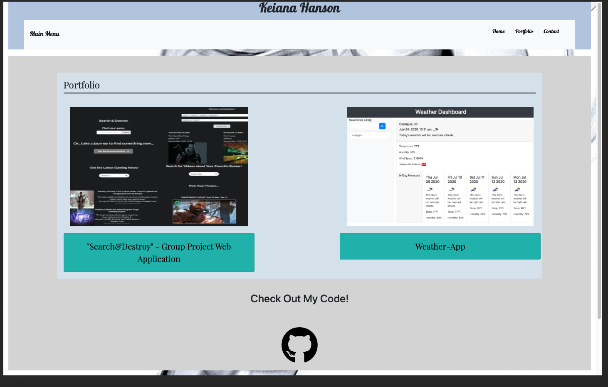
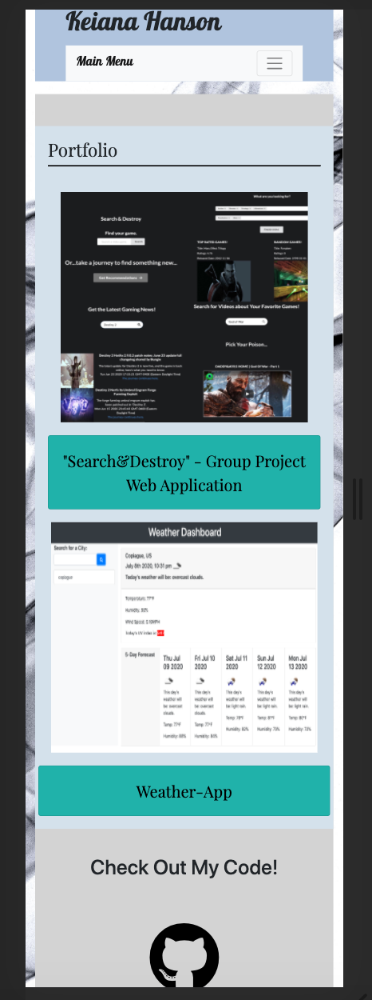

# Portfolio.Ver-2.0

## Updated Portfolio

This updated version of my portfolio highlights some new concepts I have learned during for the last 5 months of my enrollement in Colmbia University's FullStack Coding BootCamp. I am almost completed with the 6 month program, and so far I have learned about:

## Front-End
*HTML
*CSS
*Javascript
*JQuery
*Third-Party APIs

## Back-End
*ORMs, MySql, Sequelize
*MVC models
*Node.js/Express

These concepts are higligted in my updated "Portfolio" HTML file, which now holds images and the deployed links of projects/assignments I've worked on during the course.

### View my updated portfolio here!
https://microxgleek94.github.io/Portfolio.Ver-2.0/

### Check out version 1.0
https://microxgleek94.github.io/Responsive-Bootstrap-Website/

## Some Screenshots of the Mobile and Desktop Views of the website:
 
 
 
 

### Future Developments
*Add JS to handle the contact page and have emails be sent to me
*Add JS to have a splash container front page, user has to click a button to enter the website, the spash container gets hidden and then the "main" page with links shows